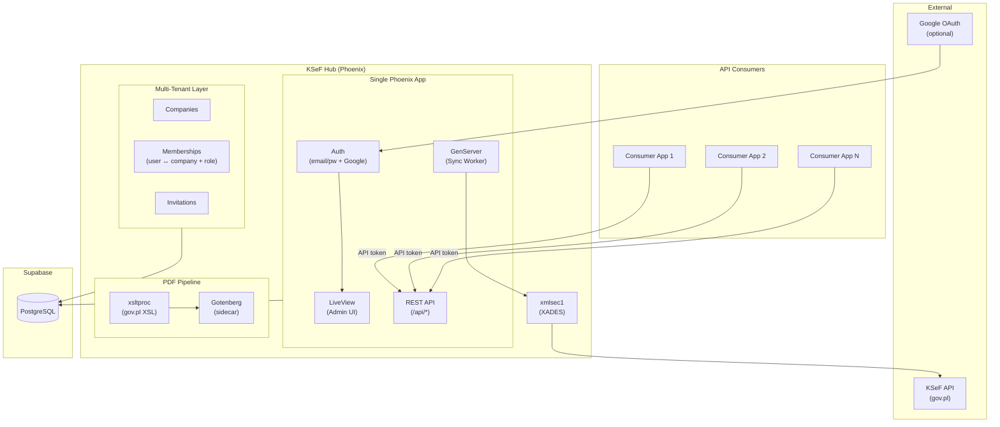
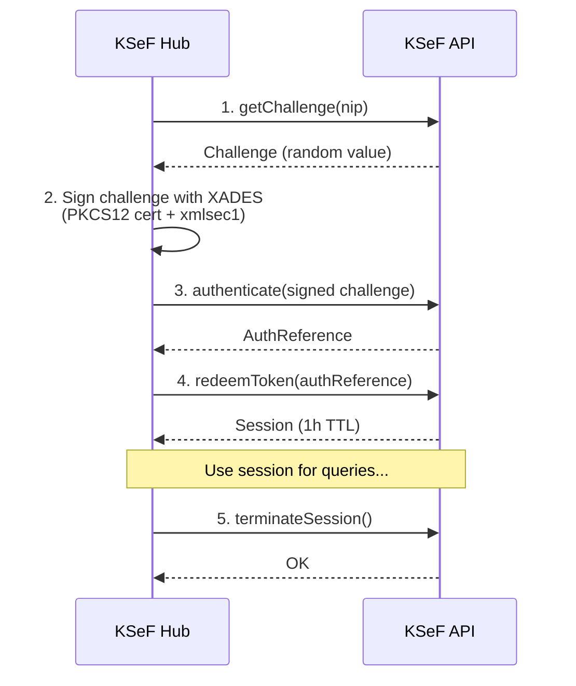
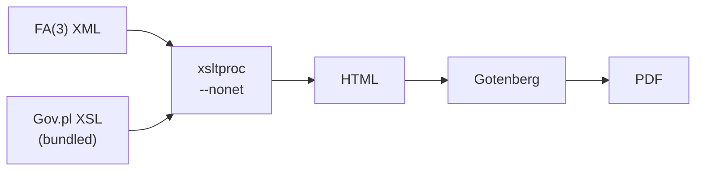
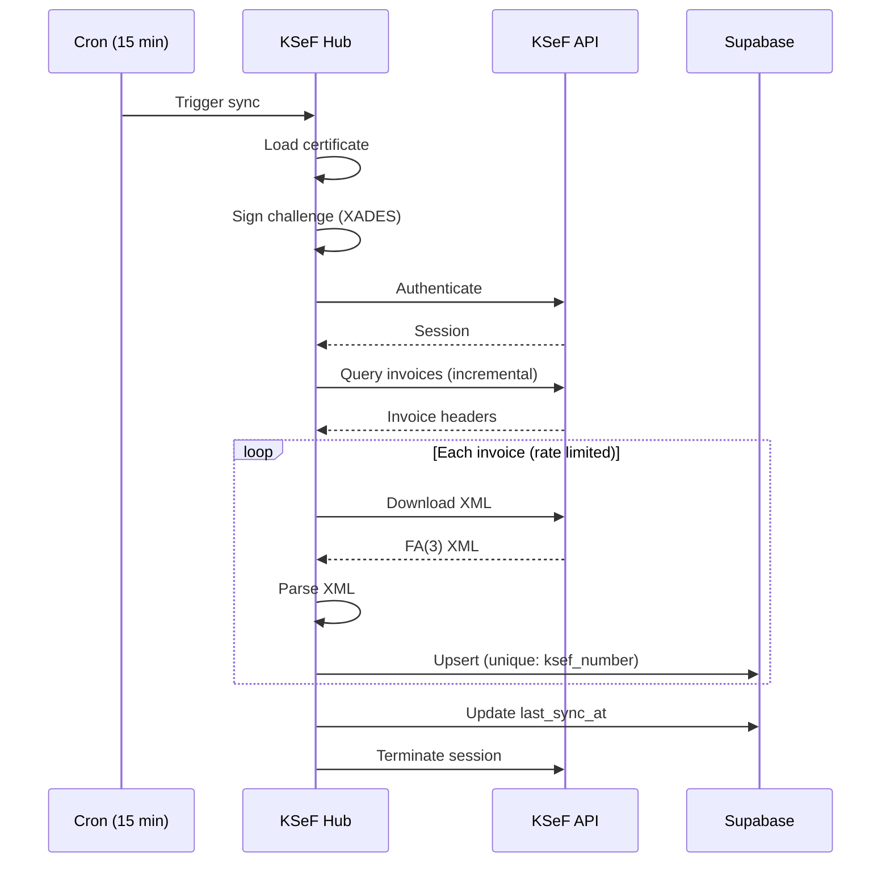

# KSeF Hub - Product Requirements Document

> **"Code is written once, but analysed multiple times."**
>
> This project balances readability with leveraging Elixir's powerful abstractions. We write succinct, smart code using pattern matching, pipelines, and functional composition - but always with clarity of intent.

---

## Executive Summary

**KSeF Hub** is a multi-tenant service for Poland's National e-Invoice System (KSeF). It handles the complexity of KSeF integration — certificate authentication, XADES signing, XML parsing, invoice sync — and exposes clean REST APIs and a self-service admin UI for multiple companies and teams.

KSeF stores invoices as FA(3) XML documents. This service syncs those documents, parses them, transforms them to HTML/PDF using official gov.pl stylesheets, and provides structured data via API. Any user can sign up, create a company, invite team members, and start syncing invoices.

---

## Problem Statement

KSeF integration is complex:

| Complexity | Description |
|------------|-------------|
| **Certificate Auth** | Requires PKCS12 certificates, XADES-ENVELOPED signatures |
| **XML Parsing** | FA(3) schema with Polish field names, nested structure |
| **PDF Generation** | Must use official gov.pl XSL stylesheets for compliance |
| **Rate Limits** | 8 req/s download, 2 req/s query |
| **Session Management** | 1-hour TTL, requires refresh or re-auth |

Embedding this complexity into consumer applications (payroll, accounting, ETL) is wrong. A dedicated service should own it.

---

## Vision

> A single, dedicated service that owns all KSeF complexity - providing consumer applications with simple REST APIs to access invoice data.

---

## Technical Decisions

| Decision | Choice | Rationale |
|----------|--------|-----------|
| Language | **Elixir** | Fault-tolerant, great for background jobs, clean syntax |
| Framework | **Phoenix + LiveView** | Single app: REST API + admin UI, no separate frontend |
| Database | **Supabase (PostgreSQL)** | Managed Postgres, realtime subscriptions |
| Auth (UI) | **Email/password + Google Sign-In** | Self-service sign-up, Google as additional option |
| Auth (API) | **API tokens** | Generated per consumer application |
| Sync | **15-min cron** | Reliable polling |
| PDF | **xsltproc + Gotenberg** | Gov.pl stylesheets → HTML → PDF |
| XADES Signing | **xmlsec1** | Certificate signing for KSeF auth |
| Deployment | **Docker + GCP Cloud Run** | Containerized, scalable |
| UI Styling | **Tailwind + DaisyUI** | Light, clean, CSS-only (no JS lock-in), easy to replace |
| Methodology | **TDD** | Tests first |
| Documentation | **ADR** | Every decision documented |

---

## Core Principles

### 1. SOLID / DRY
- Single responsibility modules
- Dependency injection for testability
- No copy-paste, extract shared logic

### 2. TDD (Test-Driven Development)
- Write failing test first
- Implement minimum to pass
- Refactor with confidence

### 3. ADR (Architecture Decision Records)
```
docs/adr/
├── 0001-use-elixir.md
├── 0002-supabase-database.md
├── 0003-ksef-authentication.md
├── 0004-pdf-generation-xsltproc.md
├── 0005-xades-signing-xmlsec1.md
└── ...
```

### 4. Idiomatic Elixir
- Leverage pattern matching, pipelines (`|>`), and `with` for control flow
- Use behaviours and protocols for polymorphism
- GenServers for stateful workers
- Supervisors for fault tolerance
- Descriptive names, small focused functions
- Succinct code that reads like documentation

---

## Goals

| Goal | Description |
|------|-------------|
| Own KSeF complexity | Certificate auth, XADES signing, XML parsing, rate limits |
| Provide clean APIs | Simple REST endpoints for invoice data |
| Generate compliant PDFs | Using official gov.pl stylesheets |
| Enable any consumer | ETL pipelines, payroll systems, accounting tools |

---

## Users

Any user can sign up with email/password or Google Sign-In. There is no email allowlist — the system is self-service.

### Roles

Roles are **per-company**. The same user can be an owner in Company A, an accountant in Company B, and an invoice reviewer in Company C.

| Role | Scope | Permissions |
|------|-------|-------------|
| **Owner** | Per-company (creator) | Full access: certificates, API tokens, invite users, view/approve/reject invoices, company settings |
| **Accountant** | Per-company (invited) | View invoices, approve/reject expenses, view sync status |
| **Invoice Reviewer** | Per-company (invited) | View invoices, approve/reject expenses |

### Key Rules

- **Sign-up is open** — anyone can create an account
- **User who creates a company becomes its owner** — the owner role cannot be transferred (for now)
- **NIP is globally unique** — if a company with a given NIP already exists, the user must be invited by the existing owner
- **Certificates belong to the user (owner), not the company** — one person certificate can authenticate for multiple companies (see `docs/ksef-certificates.md`)
- **Only owners** can see and manage the Certificates tab and API Tokens tab
- **Company list** shows "Owner" / "Member" badge per company for each user

---

## Feature Requirements

### F1: Authentication

| Requirement | Priority | Description |
|-------------|----------|-------------|
| F1.1 | Must | Email/password sign-up and sign-in |
| F1.2 | Must | Email confirmation on sign-up |
| F1.3 | Must | Password reset flow |
| F1.4 | Should | Google Sign-In as additional auth method |
| F1.5 | Must | Session management (login, logout, remember me) |

### F1b: API Token Management

| Requirement | Priority | Description |
|-------------|----------|-------------|
| F1b.1 | Must | Generate API tokens with name/description |
| F1b.2 | Must | Revoke (decline) API tokens |
| F1b.3 | Must | Track last used timestamp per token |
| F1b.4 | Must | Only company owners can create/revoke tokens |
| F1b.5 | Should | Track request count per token |
| F1b.6 | Should | View token usage history |

### F1c: Company Management

| Requirement | Priority | Description |
|-------------|----------|-------------|
| F1c.1 | Must | Create company (name, NIP) |
| F1c.2 | Must | NIP globally unique — reject if company with NIP already exists |
| F1c.3 | Must | Creator becomes company owner |
| F1c.4 | Must | Company settings page (name, NIP displayed, sync config) |
| F1c.5 | Must | Company selector in UI — user can switch between companies |

### F1d: Team & Invitations

| Requirement | Priority | Description |
|-------------|----------|-------------|
| F1d.1 | Must | Owner invites user by email with role (accountant or invoice reviewer) |
| F1d.2 | Must | Invitation email sent with accept link |
| F1d.3 | Must | Invited user signs up (if new) or logs in, then joins the company |
| F1d.4 | Must | Accept/decline invitation |
| F1d.5 | Must | Owner can remove a member from the company |
| F1d.6 | Should | Owner can change a member's role |
| F1d.7 | Should | List pending invitations for a company |

### F2: KSeF Certificate (Security Compliance)

Certificates belong to the **user** (owner), not the company. One person certificate can authenticate for multiple companies where the person has KSeF authorization. See `docs/ksef-certificates.md` for background.

| Requirement | Priority | Description |
|-------------|----------|-------------|
| F2.1 | Must | Upload PKCS12 certificate (user-level, not company-level) |
| F2.2 | Must | Encrypt certificate data at rest (AES-256-GCM) |
| F2.3 | Must | Encrypt password separately (AES-256-GCM) |
| F2.4 | Must | Encryption key from Secret Manager (not in code) |
| F2.5 | Must | Display certificate expiry |
| F2.6 | Must | Audit log of certificate operations (upload, use) |
| F2.7 | Must | Only company owners can manage certificates |
| F2.8 | Must | Certificate shared across all companies the owner manages |
| F2.9 | Should | Expiry alerts |

### F3: Invoice Sync

| Requirement | Priority | Description |
|-------------|----------|-------------|
| F3.1 | Must | Sync income invoices (issued by us) |
| F3.2 | Must | Sync expense invoices (received by us) |
| F3.3 | Must | 15-minute cron job |
| F3.4 | Must | XADES certificate signing for auth |
| F3.5 | Must | Parse FA(3) XML format |
| F3.6 | Must | Store full XML + parsed fields |
| F3.7 | Must | Respect rate limits (8 req/s download, 2 req/s query) |
| F3.8 | Must | Session management (1h TTL, terminate on completion) |

### F4: Expense Invoice API

| Requirement | Priority | Description |
|-------------|----------|-------------|
| F4.1 | Must | `GET /api/expenses` - list with filters |
| F4.2 | Must | `GET /api/expenses/:id` - details |
| F4.3 | Must | `POST /api/expenses/:id/approve` |
| F4.4 | Must | `POST /api/expenses/:id/reject` |
| F4.5 | Must | `GET /api/expenses/:id/html` - HTML preview |
| F4.6 | Must | `GET /api/expenses/:id/pdf` - PDF download |

### F5: Income Invoice API

| Requirement | Priority | Description |
|-------------|----------|-------------|
| F5.1 | Must | `GET /api/income` - list with filters |
| F5.2 | Must | `GET /api/income/:id` - details |

### F6: Admin UI (LiveView)

| Requirement | Priority | Description |
|-------------|----------|-------------|
| F6.1 | Must | Company selector — switch between companies the user belongs to |
| F6.2 | Must | Dashboard — sync status, invoice counts (scoped to selected company) |
| F6.3 | Must | Invoice list with filters (type, status, date) |
| F6.4 | Must | Invoice detail with PDF preview |
| F6.5 | Must | Certificate upload page (**owner-only**) |
| F6.6 | Must | API token generation page (**owner-only**) |
| F6.7 | Must | Team management page — list members, invite, remove (**owner-only**) |
| F6.8 | Must | Company settings page (**owner-only**) |
| F6.9 | Should | Real-time sync status updates |

---

## Architecture

### System Overview



### Application Structure

```
ksef_hub/
├── lib/
│   ├── ksef_hub/                    # Business logic
│   │   ├── accounts/                # User auth (email/pw, Google, sessions)
│   │   ├── companies/               # Company CRUD, settings
│   │   ├── memberships/             # User ↔ Company join with role
│   │   ├── invitations/             # Email invitations, accept/decline
│   │   ├── invoices/                # Invoice context
│   │   ├── credentials/             # User certificates (encrypted, user-scoped)
│   │   ├── ksef_client/             # KSeF API client
│   │   └── sync_worker.ex           # GenServer for sync
│   │
│   └── ksef_hub_web/                # Web layer
│       ├── controllers/             # REST API (JSON)
│       │   └── api/
│       │       ├── expense_controller.ex
│       │       └── income_controller.ex
│       ├── live/                    # LiveView (Admin UI)
│       │   ├── dashboard_live.ex
│       │   ├── invoice_live.ex
│       │   ├── certificate_live.ex
│       │   ├── company_live.ex
│       │   └── team_live.ex
│       └── router.ex
│
├── test/
├── docs/adr/
└── mix.exs
```

### KSeF Authentication Flow



### PDF Generation Pipeline



**Key points:**
- Use official gov.pl XSL stylesheets (legal compliance)
- Bundle stylesheets locally (no runtime downloads)
- `--nonet` flag prevents network access during transformation
- Fallback HTML template if xsltproc unavailable

### Sync Flow



---

## Lessons from Swift Implementation

Based on implementing KSeF integration in Swift, these lessons inform this project:

### 1. XADES Signing is Complex

| Lesson | Application |
|--------|-------------|
| macOS has Security.framework, Linux needs xmlsec1 | Use xmlsec1 universally for consistency |
| Password must not appear in process args | Write to temp file with 0600 permissions |
| Temp files need secure cleanup | Overwrite with zeros before deletion |
| Timeout needed for external processes | 30-second limit |

### 2. FA(3) Parsing Needs Care

| Lesson | Application |
|--------|-------------|
| Polish field names (P_1, P_2, etc.) | Create clear mapping to domain fields |
| Nested structure (Podmiot1, Podmiot2, Fa) | Dedicated parser with XPath or similar |
| Multiple date formats | Handle ISO8601 with/without fractional seconds |
| Test with real XML samples | Include sample invoices in test suite |

### 3. Gov.pl Stylesheets

| Lesson | Application |
|--------|-------------|
| Must use official XSL for compliance | Bundle `fa3-styl.xsl` and `WspolneSzablonyWizualizacji.xsl` |
| Remote imports fail on Linux | Modify import paths to local |
| Schema versions change (FA(3) → FA(4)) | Script to update stylesheets |
| xsltproc works on both macOS and Linux | Use as primary method |

**Stylesheet update script needed:**
```bash
./scripts/update-ksef-stylesheet.sh
# Downloads from gov.pl, modifies imports, validates
```

### 4. Security

| Lesson | Application |
|--------|-------------|
| Certificate passwords need encryption | AES-GCM with key from Secret Manager |
| Never log passwords or certificates | Structured logging, exclude sensitive fields |
| Sanitize filenames in Content-Disposition | Prevent header injection |
| Atomic DB operations | Use constraints + transactions |

### 5. Rate Limits

| Lesson | Application |
|--------|-------------|
| 8 req/s for downloads, 2 req/s for queries | Token bucket or simple delay |
| Batch operations reduce API calls | Query headers first, then download needed |

### 6. Database Schema

```sql
-- Users (managed by phx.gen.auth)
CREATE TABLE users (
    id UUID PRIMARY KEY,
    email TEXT NOT NULL UNIQUE,
    hashed_password TEXT NOT NULL,
    confirmed_at TIMESTAMPTZ,
    inserted_at TIMESTAMPTZ DEFAULT NOW(),
    updated_at TIMESTAMPTZ DEFAULT NOW()
);

-- Companies
CREATE TABLE companies (
    id UUID PRIMARY KEY,
    name TEXT NOT NULL,
    nip TEXT NOT NULL UNIQUE,
    inserted_at TIMESTAMPTZ DEFAULT NOW(),
    updated_at TIMESTAMPTZ DEFAULT NOW()
);

-- Memberships (user ↔ company with role)
CREATE TABLE memberships (
    id UUID PRIMARY KEY,
    user_id UUID NOT NULL REFERENCES users(id) ON DELETE CASCADE,
    company_id UUID NOT NULL REFERENCES companies(id) ON DELETE CASCADE,
    role TEXT NOT NULL,  -- 'owner', 'accountant', 'invoice_reviewer'
    joined_at TIMESTAMPTZ DEFAULT NOW(),
    UNIQUE(user_id, company_id)
);

-- Invitations
CREATE TABLE invitations (
    id UUID PRIMARY KEY,
    company_id UUID NOT NULL REFERENCES companies(id) ON DELETE CASCADE,
    email TEXT NOT NULL,
    role TEXT NOT NULL,  -- 'accountant', 'invoice_reviewer'
    invited_by_id UUID NOT NULL REFERENCES users(id),
    token TEXT NOT NULL UNIQUE,
    status TEXT NOT NULL DEFAULT 'pending',  -- 'pending', 'accepted', 'declined', 'expired'
    expires_at TIMESTAMPTZ NOT NULL,
    inserted_at TIMESTAMPTZ DEFAULT NOW()
);

-- User certificates (user-scoped, not company-scoped)
CREATE TABLE user_certificates (
    id UUID PRIMARY KEY,
    user_id UUID NOT NULL REFERENCES users(id) ON DELETE CASCADE,
    certificate_data_encrypted BYTEA NOT NULL,
    certificate_password_encrypted TEXT NOT NULL,
    certificate_subject TEXT,        -- e.g., "JAN KOWALSKI, PESEL: ..."
    certificate_expires_at DATE NOT NULL,
    is_active BOOLEAN DEFAULT true,
    inserted_at TIMESTAMPTZ DEFAULT NOW(),
    updated_at TIMESTAMPTZ DEFAULT NOW()
);

-- Company KSeF config (sync state, per company)
CREATE TABLE ksef_credentials (
    id UUID PRIMARY KEY,
    company_id UUID NOT NULL REFERENCES companies(id) ON DELETE CASCADE UNIQUE,
    nip TEXT NOT NULL,
    last_sync_at TIMESTAMPTZ,
    is_active BOOLEAN DEFAULT true,
    inserted_at TIMESTAMPTZ DEFAULT NOW(),
    updated_at TIMESTAMPTZ DEFAULT NOW()
);

-- Invoices (scoped to company)
CREATE TABLE invoices (
    id UUID PRIMARY KEY,
    company_id UUID NOT NULL REFERENCES companies(id) ON DELETE CASCADE,
    ksef_number TEXT NOT NULL UNIQUE,
    type TEXT NOT NULL,  -- 'income' or 'expense'
    xml_content TEXT NOT NULL,
    -- Parsed fields
    seller_nip TEXT,
    seller_name TEXT,
    buyer_nip TEXT,
    buyer_name TEXT,
    invoice_number TEXT,
    issue_date DATE,
    net_amount DECIMAL(15,2),
    vat_amount DECIMAL(15,2),
    gross_amount DECIMAL(15,2),
    currency TEXT DEFAULT 'PLN',
    -- Status (expenses only)
    status TEXT DEFAULT 'pending',  -- pending/approved/rejected
    -- Audit
    ksef_acquisition_date TIMESTAMPTZ,
    inserted_at TIMESTAMPTZ DEFAULT NOW(),
    updated_at TIMESTAMPTZ DEFAULT NOW()
);

CREATE INDEX idx_invoices_company_type ON invoices(company_id, type, status);
CREATE INDEX idx_invoices_ksef_number ON invoices(ksef_number);
```

---

## Server Requirements

```dockerfile
# Dockerfile

# Required for XSLT transformation (gov.pl stylesheets)
RUN apt-get install -y xsltproc

# Required for XADES certificate signing
RUN apt-get install -y xmlsec1
```

---

## Security Compliance

| Area | Measure |
|------|---------|
| **Certificates** | AES-256-GCM encryption at rest |
| **Passwords** | Encrypted separately, never logged |
| **Encryption keys** | Stored in Secret Manager, not in code/env |
| **API tokens** | Hashed storage, revocable, usage tracked |
| **Authentication** | Email/password + Google Sign-In, per-company RBAC |
| **Audit trail** | Log certificate operations, token usage, sync events |
| **Temp files** | Secure cleanup (overwrite before delete) |

---

## Gov.pl Resources

| Resource | URL |
|----------|-----|
| KSeF Test Environment | https://ksef-test.mf.gov.pl |
| KSeF Production | https://ksef.mf.gov.pl |
| FA(3) Schema | http://crd.gov.pl/wzor/2025/06/25/13775/schemat.xsd |
| FA(3) Stylesheet | http://crd.gov.pl/wzor/2025/06/25/13775/styl.xsl |
| Shared Templates | http://crd.gov.pl/xml/schematy/dziedzinowe/mf/2022/01/07/eD/DefinicjeSzablony/WspolneSzablonyWizualizacji_v12-0E.xsl |

**Maintenance:** When gov.pl updates FA schema (e.g., FA(4)), run update script and redeploy.

---

## Open Questions

1. **KSeF webhooks** — Does KSeF support push notifications, or cron-only?

---

## Implementation Phases

The multi-tenant transition is broken into four phases. Each phase delivers a working system — no big-bang migration.

### Phase 1: User certificates + membership foundation

- Create `user_certificates` table — move cert data from `ksef_credentials` to user-scoped storage
- Create `companies` table and `memberships` table (user ↔ company with role)
- Migrate existing data: current users become owners of existing companies
- Update `ksef_credentials` to reference company (not hold cert data)
- Role-based UI visibility: Certificates tab and API Tokens tab visible only to owners

### Phase 2: Email/password authentication

- Add sign-up/sign-in with email and password (`phx.gen.auth` or similar)
- Email confirmation on sign-up
- Password reset flow
- Keep Google Sign-In as additional auth method
- Remove `ALLOWED_EMAILS` gate entirely

### Phase 3: Invitation system

- Owner can invite users by email with a role (accountant or invoice reviewer)
- Invitation email with accept link
- Invited user signs up (if new) or logs in, then joins the company
- Team management page: list members, remove, change role
- Pending invitations list

### Phase 4: API token scoping

- API tokens scoped to a company (not just a user)
- Only owners can create/revoke tokens for their company
- Token validation checks company membership
- Track usage per token per company
